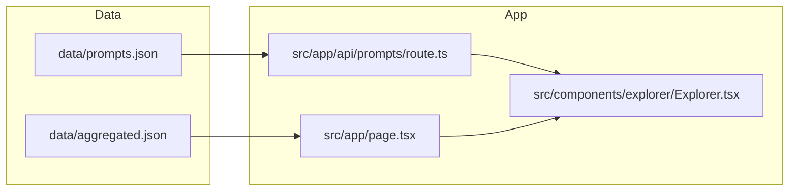

# Stimulate

Stimulate is a professional AI builder directory for discovering, comparing, and using:

- Skills
- MCP servers
- Agents
- Prompt libraries

The product keeps these resources inside a single clean site experience instead of scattering them across separate repositories and pages.

## Product Goal

The goal of Stimulate is to make AI builder resources easy to browse, compare, and reuse.

It combines curated catalogs, extracted prompt libraries, and a compact in-site UI so users can move from discovery to action quickly.

## What The Site Contains

### Skills

Curated AI skills and task-oriented building blocks.

### MCP Servers

Model Context Protocol servers, SDKs, and tool integrations.

### Agents

Autonomous agents, multi-agent frameworks, coding agents, research agents, and orchestration tools.

### Prompts

Prompt libraries, system prompts, role prompts, coding prompts, and agent prompt patterns rendered directly inside the site.

## Main Site Sections

1. Hero overview with live catalog counts
2. Featured skills, categories, and publishers
3. Explorer with filtering for Skills, MCP, Agents, and Prompts
4. Prompt modal viewer with full prompt text
5. How-it-works overview
6. Footer navigation and product summary

## User Experience

The UI is designed to stay focused and practical:

- Square, consistent controls
- Fast filtering and search
- Prompt cards with a full-view modal
- English-only visible card copy
- Responsive layout for desktop, tablet, and mobile

## Data Sources

The site uses local generated datasets and does not require users to leave the site experience:

- `data/aggregated.json` for skills, MCP servers, agents, and catalog metadata
- `data/prompts.json` for extracted prompt-library content

Prompt content is collected from curated public repositories, deduplicated locally, filtered for quality, and served through a local API.

## Prompt Library Flow

```mermaid
flowchart LR
	A[Curated Prompt Repositories] --> B[Local Clone and Extraction]
	B --> C[Deduplication and Quality Filtering]
	C --> D[data/prompts.json]
	D --> E[/api/prompts]
	E --> F[Explorer Prompt Tab]
	F --> G[Modal Full Prompt View]
```

## Architecture



## Prompt Library Details

The prompt feed shows:

- Prompt title
- Short English summary
- Full prompt text in a modal viewer
- Source repository
- Source path inside the repository
- Tier label

## Site Behavior

- Skills, MCP servers, and agents are shown through the catalog explorer.
- Prompts are available in the same explorer experience as a dedicated tab.
- Prompt cards open a modal overlay with the full prompt text.
- The prompt feed is filtered to English-like, higher-quality entries.

## Tech Stack

- Next.js 16
- React 19
- TypeScript
- Tailwind CSS v4 + custom CSS

## Development

```bash
npm install
npm run dev
```

## Validation

```bash
npm run lint
npm run build
```

## Ingestion Commands

- `npm run ingest` - existing catalog ingestion flow
- `npm run ingest:master` - existing master list ingestion flow
- `npm run ingest:prompts` - prompt extraction from curated repositories

## Repository Layout

- `src/app` - routes, layout, and API endpoints
- `src/components` - dashboard sections and explorer UI
- `src/lib/data` - dataset loaders
- `scripts/ingest` - local extraction and ingestion scripts
- `data` - generated datasets used by the site

## Notes

The site is intentionally optimized for browsing and reuse, not outbound navigation. Content is normalized, deduplicated, and surfaced directly inside the product.