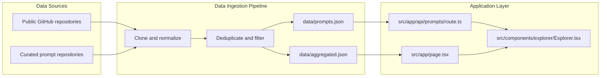
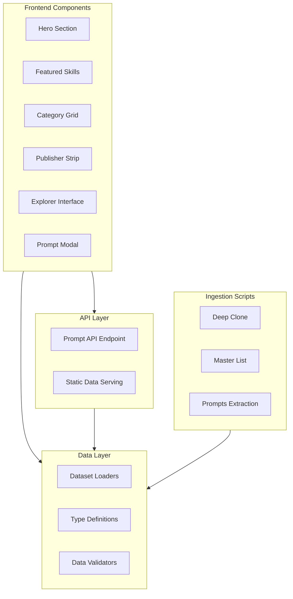

# A place where you cam like to live with these AI Era

<div align="center">

**A Comprehensive AI Builder Ecosystem Catalog**

[](https://nextjs.org/)
[](https://react.dev/)
[](https://www.typescriptlang.org/)
[](https://tailwindcss.com/)

**Discover • Compare • Build**

</div>

---

## Overview

Stimulate is a unified, comprehensive catalog for discovering and comparing the entire AI builder ecosystem. It consolidates fragmented resources across multiple categories into a single, intuitive product experience.

### Core Categories

- **Skills** - Task-oriented building blocks, agent skills, prompt-engineering guides, and reusable workflow assets
- **MCP Servers** - Model Context Protocol servers, SDKs, connectors, and tool servers
- **Agents** - Autonomous agents, coding agents, research agents, browser agents, multi-agent frameworks, and orchestration platforms
- **Prompts** - Prompt libraries, system prompts, role prompts, prompt-engineering guides, and prompt patterns
- **LLM Apps & Tooling** - Frameworks, evaluation tools, RAG systems, and supporting infrastructure

### Key Differentiator

Unlike traditional directories that redirect users to external repositories, Stimulate keeps all material inside one cohesive product experience. Users can browse, compare, and inspect resources without leaving the platform.

## What This Repository Is

This project is a **synthesized, curated directory** built from public repositories. The content is normalized into a unified browsing experience and grouped by capability so users can scan the ecosystem quickly.

The site does not copy external README files verbatim. It aggregates the source material into a cleaner index, then presents the key ideas, categories, and linked projects in one place.

## Main Experience

### Hero Section
- **Live Statistics Dashboard** - Real-time counts for skills, MCP servers, and agents
- **Dynamic Metrics** - Automatically updated statistics based on current dataset
- **Visual Overview** - Quick snapshot of the entire ecosystem

### Featured Content
- **Featured Skills** - Highlighted top-rated and trending skills
- **Category Grid** - Visual navigation through different capability areas
- **Publisher Strip** - Top contributors and organizations

### Explorer Interface
- **Multi-Tab Navigation** - Seamless switching between Skills, MCP, Agents, and Prompts
- **Advanced Filtering** - Filter by category, publisher, and type
- **Real-time Search** - Instant search across all items
- **Smart Sorting** - Sort by relevance, name, or publisher

### Prompt Viewer
- **Modal Overlay** - Full prompt text displayed in elegant modal
- **Syntax Highlighting** - Enhanced readability for prompt content
- **Quick Access** - One-click viewing without leaving the page

### Footer Navigation
- **Product Summary** - Quick overview and key statistics
- **Navigation Links** - Easy access to all sections
- **Brand Information** - Project details and credits

## Product Scope

### Skills
Task-oriented building blocks, agent skills, prompt-engineering guides, and reusable workflow assets designed to accelerate AI development.

### MCP Servers
Model Context Protocol servers, SDKs, connectors, and tool servers that enable seamless integration with AI models and applications.

### Agents
Autonomous agents, coding agents, research agents, browser agents, multi-agent frameworks, and orchestration platforms for building intelligent systems.

### Prompts
Prompt libraries, system prompts, role prompts, prompt-engineering guides, and prompt patterns shown inside the same Explorer experience instead of a separate section.

### Adjacent Layers
RAG stacks, LLM apps, local model runtimes, evaluation tools, observability, guardrails, sandboxing, and workflow infrastructure that support the AI ecosystem.

## Why The Catalog Exists

The AI ecosystem is **fragmented** across dozens of repositories, documentation sites, and issue trackers. This project brings together the most useful sources so builders can compare tools without jumping between multiple platforms.

### Target Audience

This catalog is designed for:

- **AI Builders** - Developers building AI-powered applications and services
- **Prompt Engineers** - Specialists crafting and optimizing prompts for LLMs
- **Agent Developers** - Engineers creating autonomous AI agents and systems
- **MCP Builders** - Developers working with Model Context Protocol integrations
- **Product Teams** - Teams exploring and evaluating the AI technology stack
- **Researchers** - Academic and industry researchers studying AI ecosystems
- **Technical Leaders** - CTOs, VPs of Engineering, and technical decision-makers

### Value Proposition

- **Time Savings** - Eliminate hours of searching across multiple repositories
- **Comprehensive Coverage** - Access curated content from across the entire ecosystem
- **Unified Experience** - Single interface for browsing, comparing, and inspecting resources
- **Quality Filtering** - Curated content with deduplication and quality checks
- **Stay Updated** - Regularly updated with the latest tools and frameworks

## How The Site Is Organized

### Browse
Use the Explorer to switch between the core tabs (Skills, MCP, Agents, Prompts) and filter by category, publisher, or type. The intuitive interface makes navigation seamless.

### Inspect
Open any item to review detailed descriptions, source metadata, tags, and direct links to original repositories. Get comprehensive information without leaving the platform.

### Read Prompts In Place
Prompt content is rendered directly in the UI and opened in an elegant modal overlay. Read full prompts without navigating away to external repositories.

### Compare Sources
Projects from the same family are intelligently grouped together, enabling side-by-side comparison of similar repositories and tools.

## Data Model

The site is driven by generated local datasets that power the entire application:

### Core Datasets

- **`data/aggregated.json`** - Main catalog containing all skills, MCP servers, agents, and repositories
- **`data/prompts.json`** - Extracted prompt-library content with deduplicated and filtered prompts

### Data Pipeline

Prompt content is collected from curated public repositories, deduplicated locally, filtered for quality, and served through a local API endpoint (`/api/prompts`). This ensures:

- **Data Freshness** - Regular updates from source repositories
- **Quality Control** - Automated filtering for high-quality content
- **Deduplication** - Removal of duplicate entries across sources
- **Performance** - Local API for fast, reliable access

## Architecture

### System Architecture Diagram



### Component Architecture



## Prompt Flow


### Prompt Processing Pipeline

1. **Repository Scanning** - Automated scanning of curated prompt repositories
2. **Content Extraction** - Intelligent extraction of prompt content from various file formats
3. **Deduplication** - Removal of duplicate prompts across different sources
4. **Quality Filtering** - AI-powered quality assessment and filtering
5. **Tier Classification** - Categorization by quality tiers (Tier 1, Tier 2, etc.)
6. **API Serving** - Fast, reliable serving through local API endpoint

## Source Families Represented

### Awesome AI Agents And General Lists
Curated discovery lists covering agents, CLI coding agents, LLM agents, AI agents, and app catalogs from community-maintained awesome lists.

### MCP And Tooling
The official Model Context Protocol organization, SDKs, server collections, and popular MCP server implementations for seamless AI integrations.

### Prompt Libraries And Prompt Engineering
Prompt repositories, prompt-engineering guides, system prompt collections, and prompt safety resources from leading AI researchers and practitioners.

### LLM Apps, Frameworks, And Agent Builders
Frameworks and app builders such as:
- **LangChain** - Comprehensive framework for LLM application development
- **LangGraph** - Stateful, multi-actor applications with LLMs
- **AutoGen** - Multi-agent conversation framework
- **Semantic Kernel** - SDK for integrating LLMs with conventional programming languages
- **CrewAI** - Framework for orchestrating role-playing autonomous AI agents
- **MetaGPT** - Multi-agent framework that assigns different roles to GPTs
- **ChatDev** - Software development company powered by AI agents
- **OpenHands** - Open-source AI software engineer
- **OpenDevin** - Open-source software developer
- **Flowise** - Drag-and-drop LLM app builder
- **Dify** - LLMOps platform for building AI applications

### RAG, Search, And Knowledge Systems
RAG pipelines, retrieval frameworks, search assistants, document parsers, memory systems, and knowledge engines such as:
- **LlamaIndex** - Data framework for LLM applications
- **Haystack** - Open-source NLP framework
- **RAGFlow** - Deep document understanding for retrieval
- **txtai** - Semantic search and workflows
- **Mem0** - Memory layer for AI applications
- **Zep** - Long-term memory for AI agents
- **Jina** - Neural search ecosystem
- **Weaviate** - Vector database and search engine
- **GraphRAG** - Knowledge graph enhanced RAG
- **LightRAG** - Lightweight RAG framework

### Local Models And Inference
Local model runtimes, inference servers, open model tooling, and training utilities such as:
- **Ollama** - Run large language models locally
- **llama.cpp** - Port of LLaMA model in C/C++
- **vLLM** - High-throughput serving engine
- **TGI** - Text Generation Inference
- **FastChat** - Open platform for training, serving, and evaluating LLMs
- **Open WebUI** - Self-hosted Web UI for LLMs
- **Jan** - Open-source ChatGPT alternative
- **LocalAI** - Open-source OpenAI alternative
- **MLC-LLM** - Machine Learning Compilation for LLMs
- **Exo** - Run local AI models on consumer hardware
- **Transformers** - State-of-the-art machine learning for PyTorch
- **PEFT** - Parameter-Efficient Fine-Tuning
- **TRL** - Transformer Reinforcement Learning
- **Unsloth** - Fine-tune LLMs faster

### Browser, Web, And Automation Agents
Browser automation, web agents, and site interaction tools such as:
- **browser-use** - AI browser automation
- **BrowserGym** - Benchmark for web agents
- **Playwright** - Reliable end-to-end testing
- **Puppeteer** - Headless Chrome Node API
- **Stagehand** - Web automation framework
- **Firecrawl** - Web crawling and scraping
- **Crawl4AI** - Web crawling for AI
- **Skyvern** - Automated web workflows
- **Selenium** - Web browser automation

### Voice, Vision, And Multimodal Agents
Voice agents, transcription, TTS, and multimodal tooling such as:
- **LiveKit Agents** - Real-time voice and video AI agents
- **Pipecat** - Framework for voice and multimodal AI
- **Whisper** - Automatic speech recognition
- **Whisper.cpp** - Port of Whisper in C/C++
- **Coqui TTS** - Deep learning text-to-speech
- **OpenVoice** - Voice cloning
- **Piper** - Fast neural text-to-speech
- **Smolagents** - Lightweight multimodal agents

### Monitoring, Evaluation, Guardrails, And LLMOps
Observability, evals, guardrails, red teaming, and tracing tools such as:
- **Langfuse** - Open-source LLM engineering platform
- **Phoenix** - AI observability and evaluation
- **DeepEval** - LLM evaluation framework
- **Ragas** - Evaluation framework for RAG pipelines
- **promptfoo** - Prompt engineering tool
- **Braintrust** - AI evaluation platform
- **Helicone** - LLM observability and analytics
- **Guardrails** - Input/output safeguards for LLMs
- **NeMo Guardrails** - Toolkit for controlling LLMs

### Platform, Infrastructure, And Tooling
SDKs, orchestration, sandboxing, app frameworks, vector databases, and infra tools such as:
- **Composio** - AI tool integrations
- **Unstructured** - Data ingestion and processing
- **E2B** - Code execution sandboxes
- **Daytona** - Development environment automation
- **Modal** - Serverless computing platform
- **n8n** - Workflow automation
- **Chainlit** - Build AI apps in Python
- **Gradio** - Machine learning UI framework
- **Streamlit** - Data app framework
- **FastAPI** - Modern web framework for Python
- **Reflex** - Web apps in pure Python
- **Vanna** - SQL generation via RAG
- **DB-GPT** - Database-aware GPT
- **DuckDB** - In-process SQL database
- **Chroma** - Open-source embedding database
- **Qdrant** - Vector similarity search engine
- **Weaviate** - Vector database and search
- **Milvus** - Vector database for AI
- **pgvector** - Vector similarity for PostgreSQL
- **Redis** - In-memory data structure store
- **Vespa** - Feature-rich search engine
- **Marqo** - Tensor search engine
- **Turbopuffer** - Vector database
- **LanceDB** - Serverless vector database
- **FAISS** - Efficient similarity search

## Site Behavior

- **Unified Explorer** - Skills, MCP servers, and agents are shown through the catalog explorer with consistent UI patterns
- **Integrated Prompts** - Prompts are available in the same explorer experience as a dedicated tab, not a separate section
- **Modal Viewing** - Prompt cards open a modal overlay with the full prompt text for seamless reading
- **Quality Filtering** - The prompt feed is filtered to English-like, higher-quality entries for better user experience
- **Stay-in-App Experience** - The UI avoids forcing the user out to GitHub for every item, keeping users engaged

## User Experience Notes

The UI is designed to stay focused and practical with attention to detail:

### Design Principles
- **Square, Consistent Controls** - Uniform UI elements for predictable interactions
- **Fast Filtering and Search** - Instant response to user queries and filters
- **Prompt Cards with Full-View Modal** - One-click access to complete prompt content
- **English-Only Visible Card Copy** - Clean, readable content without language barriers
- **Responsive Layout** - Optimized for desktop, tablet, and mobile devices

### Performance Optimizations
- **Slim Client Payload** - Explorer uses slim projections to keep HTML payload small (~5MB full dataset reduced to minimal client data)
- **Lazy Loading** - Components load efficiently for fast initial render
- **Smart Caching** - Dataset caching for instant subsequent loads
- **Optimized Filtering** - Client-side filtering for instant response times

## Tech Stack

### Frontend Framework
- **Next.js 16.2.10** - React framework with App Router for optimal performance
- **React 19.2.4** - Latest React with concurrent features and improved performance
- **TypeScript 5.x** - Type-safe development with enhanced developer experience

### Styling
- **Tailwind CSS v4** - Utility-first CSS framework for rapid UI development
- **Custom CSS** - Tailored styles for specific component requirements
- **PostCSS** - CSS transformation and optimization

### Development Tools
- **ESLint 9** - Code linting and quality assurance
- **ESLint Config Next** - Next.js specific linting rules
- **TypeScript Compiler** - Type checking and compilation

### Data Processing
- **Cheerio 1.2.0** - Fast and flexible HTML parsing for data extraction
- **Node.js** - Server-side JavaScript runtime for data ingestion scripts

### Build & Deployment
- **Next.js Build System** - Optimized production builds
- **Static Generation** - Pre-rendered pages for maximum performance
- **API Routes** - Serverless API endpoints for dynamic data

## Development

### Prerequisites
- Node.js 20+ 
- npm or yarn package manager

### Installation

```bash
# Install dependencies
npm install
```

### Development Server

```bash
# Start development server
npm run dev
```

The application will be available at `http://localhost:3000`

### Build for Production

```bash
# Create production build
npm run build

# Start production server
npm start
```

## Validation

### Code Quality

```bash
# Run ESLint
npm run lint

# Build project (includes type checking)
npm run build
```

### Type Checking
TypeScript compilation is automatically performed during the build process to ensure type safety across the codebase.

## Ingestion Commands

### Data Ingestion Scripts

```bash
# Main catalog ingestion flow
npm run ingest

# Master list ingestion flow
npm run ingest:master

# Prompt extraction from curated repositories
npm run ingest:prompts
```

### Ingestion Process Details

1. **Deep Clone (`npm run ingest`)**
   - Clones public repositories locally
   - Normalizes data structures
   - Extracts metadata and descriptions
   - Generates `data/aggregated.json`

2. **Master List (`npm run ingest:master`)**
   - Processes curated master lists
   - Aggregates items from multiple sources
   - Updates source reports and metrics

3. **Prompts Extraction (`npm run ingest:prompts`)**
   - Scans prompt repositories
   - Extracts prompt content
   - Deduplicates and filters prompts
   - Generates `data/prompts.json`

## Repository Layout

### Directory Structure

```
stimulate/
├── src/
│   ├── app/                    # Next.js App Router pages and API routes
│   │   ├── api/               # API endpoints
│   │   │   └── prompts/       # Prompt API route
│   │   ├── explore/           # Explorer page
│   │   ├── item/              # Individual item pages
│   │   ├── publishers/        # Publisher pages
│   │   ├── layout.tsx         # Root layout
│   │   ├── page.tsx           # Home page
│   │   └── globals.css        # Global styles
│   ├── components/            # React components
│   │   ├── dashboard/         # Dashboard components
│   │   │   ├── Hero.tsx
│   │   │   ├── FeaturedSkills.tsx
│   │   │   ├── CategoryGrid.tsx
│   │   │   ├── PublisherStrip.tsx
│   │   │   ├── HowItWorks.tsx
│   │   │   ├── TopRepositories.tsx
│   │   │   └── PromptsSection.tsx
│   │   ├── explorer/          # Explorer component
│   │   │   └── Explorer.tsx
│   │   └── layout/            # Layout components
│   │       ├── TopBar.tsx
│   │       └── SiteFooter.tsx
│   ├── lib/                   # Utility libraries
│   │   └── data/             # Data loading utilities
│   │       ├── loadData.ts
│   │       └── cleanedData.ts
│   └── types/                # TypeScript type definitions
│       └── index.ts
├── scripts/                   # Build and ingestion scripts
│   └── ingest/               # Data ingestion scripts
│       ├── deep-clone.mjs
│       ├── master-list.mjs
│       └── prompts-from-repos.mjs
├── data/                     # Generated datasets
│   ├── aggregated.json       # Main catalog data
│   └── prompts.json          # Prompt library data
├── public/                   # Static assets
├── .gitignore               # Git ignore rules
├── eslint.config.mjs        # ESLint configuration
├── next.config.ts           # Next.js configuration
├── package.json             # Project dependencies
├── postcss.config.mjs       # PostCSS configuration
├── tsconfig.json            # TypeScript configuration
└── README.md                # This file
```

### Key Components

#### Frontend Components
- **Hero** - Landing section with statistics and overview
- **FeaturedSkills** - Highlighted top skills
- **CategoryGrid** - Visual category navigation
- **PublisherStrip** - Top publishers display
- **Explorer** - Main browsing interface with tabs and filters
- **Prompt Modal** - Full prompt viewer overlay

#### Data Layer
- **loadData.ts** - Dataset loading and caching
- **cleanedData.ts** - Data cleaning and validation
- **Type Definitions** - Comprehensive TypeScript interfaces

#### API Layer
- **Prompts API** - Serverless endpoint for prompt queries
- **Static Data Serving** - Efficient JSON data delivery

## Features

### Core Features
- **Unified Catalog** - Single interface for browsing skills, MCP servers, agents, and prompts
- **Advanced Filtering** - Filter by category, publisher, type, and custom criteria
- **Real-time Search** - Instant search across all catalog items
- **Smart Categorization** - Automatic categorization and tagging of items
- **Quality Scoring** - Tier-based quality classification for prompts
- **Multi-language Support** - English-focused content with translation indicators

### User Experience Features
- **Responsive Design** - Optimized для desktop, tablet, and mobile
- **Fast Navigation** - Quick tab switching and instant filtering
- **Modal Viewing** - Seamless prompt viewing without page navigation
- **Publisher Analytics** - Track top publishers and their contributions
- **Repository Rankings** - Discover trending and highly-referenced repositories
- **Source Reports** - Detailed metrics on data sources and extraction quality

### Developer Features
- **Type Safety** - Full TypeScript coverage with comprehensive type definitions
- **Modular Architecture** - Clean separation of concerns for easy maintenance
- **Extensible Design** - Easy to add new data sources and categories
- **Performance Optimized** - Slim client payloads and efficient data loading
- **Development Tools** - ESLint, TypeScript, and modern build tooling

## Deployment

### Deployment Options

#### Vercel (Recommended)
```bash
# Install Vercel CLI
npm i -g vercel

# Deploy
vercel
```

#### Other Platforms
The application can be deployed to any platform that supports Next.js:
- Netlify
- AWS Amplify
- Cloudflare Pages
- Railway
- Render
- Self-hosted with Node.js

### Environment Variables
Currently, the application uses no external API keys or environment variables. All data is generated locally through ingestion scripts.

### Build Configuration
The application is configured for static generation where possible, with API routes for dynamic data serving.

## Contributing

### How to Contribute
Contributions are welcome! Here are ways you can help:

1. **Add New Data Sources** - Extend the ingestion scripts to include new repositories
2. **Improve Filtering** - Enhance the quality and accuracy of data filtering
3. **UI/UX Improvements** - Suggest or implement UI enhancements
4. **Bug Fixes** - Report and fix bugs
5. **Documentation** - Improve documentation and examples

### Development Workflow
1. Fork the repository
2. Create a feature branch (`git checkout -b feature/amazing-feature`)
3. Make your changes
4. Run tests and linting (`npm run lint && npm run build`)
5. Commit your changes
6. Push to the branch (`git push origin feature/amazing-feature`)
7. Open a Pull Request

### Code Style
- Follow existing code style and patterns
- Use TypeScript for all new code
- Add comments for complex logic
- Keep components small and focused
- Use descriptive variable and function names

## License

This project is provided as-is for educational and discovery purposes. Please refer to individual source repositories for their specific licenses.

## Acknowledgments

### Data Sources
This project aggregates content from numerous open-source repositories and curated lists. We thank all the maintainers and contributors of these projects for their valuable work in the AI ecosystem.

### Technologies
- Next.js team for the amazing framework
- React team for the UI library
- Tailwind CSS team for the styling framework
- TypeScript team for the language
- All open-source contributors who make this ecosystem possible

## Support

### Getting Help
- Open an issue on GitHub for bug reports or feature requests
- Check existing issues for solutions
- Review the documentation for common questions

### Community
Join the community to connect with other AI builders and share your experiences with the catalog.

## Future Roadmap

### Planned Features
- **Advanced Search** - Full-text search with semantic matching
- **User Accounts** - Save favorites and create custom collections
- **API Access** - Public API for programmatic access to the catalog
- **Real-time Updates** - Automatic syncing with source repositories
- **Analytics Dashboard** - Detailed usage and trend analytics
- **Community Contributions** - Allow users to submit new items
- **Internationalization** - Support for multiple languages
- **Mobile App** - Native mobile applications
- **Browser Extension** - Quick access from the browser
- **Integration Hub** - Direct integration with popular AI tools

### Data Expansion
- **More Categories** - Expand to cover additional AI ecosystem areas
- **Deeper Metadata** - Add more detailed information for each item
- **Version Tracking** - Track version history and updates
- **Dependency Graph** - Visualize relationships between projects
- **Performance Metrics** - Include performance benchmarks and comparisons

---

<div align="center">

**Built with love for the AI Builder Community**

**Stimulate — Your Gateway to the AI Ecosystem**

</div>
