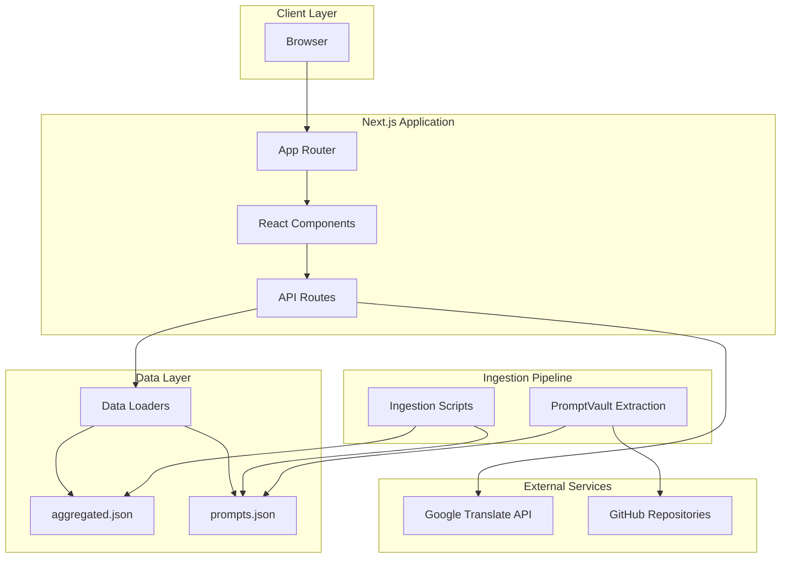
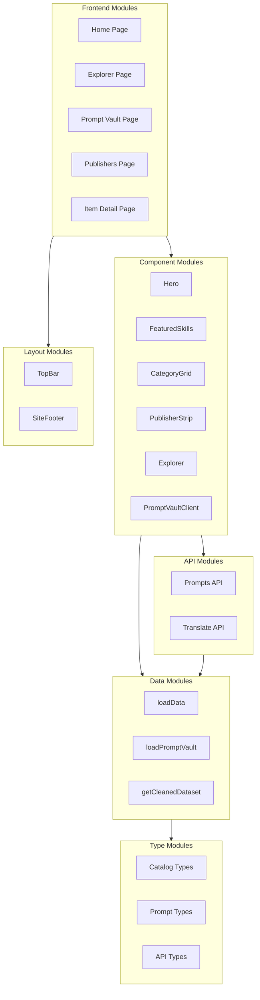
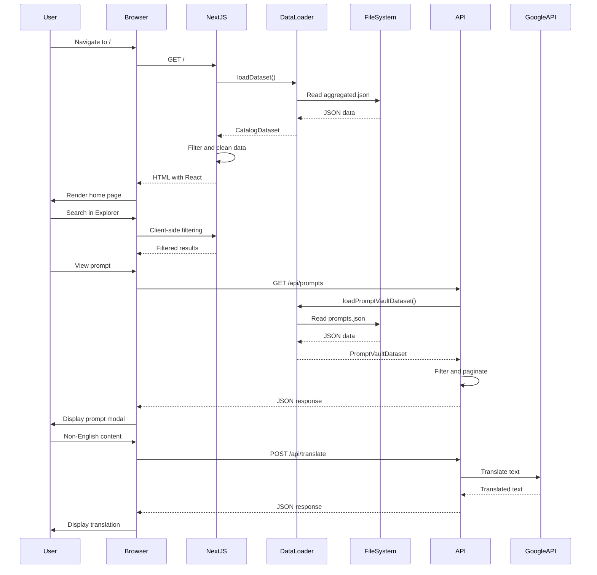
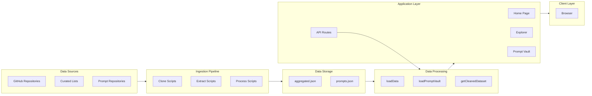
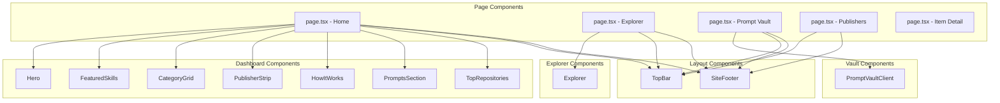
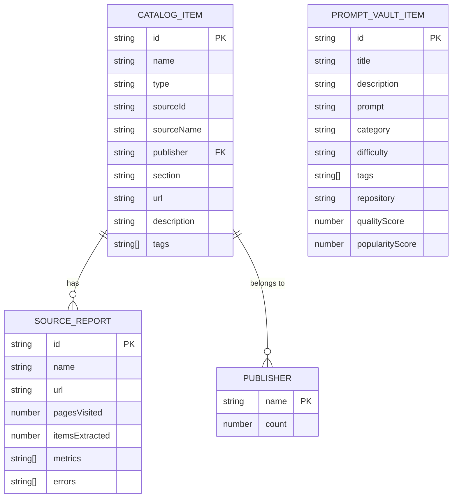

# Stimulate

A unified, comprehensive catalog for discovering and comparing the entire AI builder ecosystem. Stimulate consolidates fragmented resources across multiple categories into a single, intuitive product experience.

## Executive Summary

Stimulate is a synthesized, curated directory built from public repositories that normalizes content into a unified browsing experience. The platform aggregates skills, MCP servers, agents, and prompts from across the AI ecosystem, enabling builders to compare tools without navigating between multiple platforms. The application is built as a modern Next.js application with TypeScript, featuring real-time search, advanced filtering, and a prompt vault with modal viewing capabilities.

## Table of Contents

- [Project Overview](#project-overview)
- [Key Features](#key-features)
- [Functionalities](#functionalities)
- [Technology Stack](#technology-stack)
- [Repository Structure](#repository-structure)
- [System Architecture](#system-architecture)
- [Module Architecture](#module-architecture)
- [End-to-End Request Flow](#end-to-end-request-flow)
- [Application Workflow](#application-workflow)
- [Data Flow Diagram](#data-flow-diagram)
- [Component Architecture](#component-architecture)
- [Backend Architecture](#backend-architecture)
- [Frontend Architecture](#frontend-architecture)
- [Database Design](#database-design)
- [API Documentation](#api-documentation)
- [Authentication](#authentication)
- [Authorization](#authorization)
- [Environment Variables](#environment-variables)
- [Installation](#installation)
- [Development Setup](#development-setup)
- [Production Deployment](#production-deployment)
- [Build Process](#build-process)
- [Configuration](#configuration)
- [Scripts](#scripts)
- [Performance Optimizations](#performance-optimizations)
- [Security](#security)
- [Logging](#logging)
- [Monitoring](#monitoring)
- [Error Handling](#error-handling)
- [Testing](#testing)
- [Scalability](#scalability)
- [Accessibility](#accessibility)
- [Browser Support](#browser-support)
- [Mobile Responsiveness](#mobile-responsiveness)
- [Internationalization](#internationalization)
- [AI Features](#ai-features)
- [Integrations](#integrations)
- [Dependencies](#dependencies)
- [Screens](#screens)
- [User Journey](#user-journey)
- [Project Lifecycle](#project-lifecycle)
- [Future Enhancements](#future-enhancements)
- [Known Limitations](#known-limitations)
- [Troubleshooting](#troubleshooting)
- [FAQ](#faq)
- [Contributing Guidelines](#contributing-guidelines)
- [Coding Standards](#coding-standards)
- [Branch Strategy](#branch-strategy)
- [Versioning](#versioning)
- [License](#license)
- [Credits](#credits)

## Project Overview

Stimulate exists to solve the fragmentation problem in the AI ecosystem. Resources are scattered across dozens of repositories, documentation sites, and issue trackers. This project brings together the most useful sources so builders can compare tools without jumping between multiple platforms.

### Why It Exists

The AI ecosystem is fragmented across:
- Multiple GitHub repositories with inconsistent documentation
- Curated lists that are not discoverable
- Documentation sites that lack unified search
- Issue trackers and discussion forums
- Platform-specific marketplaces

Stimulate aggregates these sources into a single, searchable, filterable interface with consistent data structures and presentation patterns.

### Core Philosophy

- **Unified Experience**: Keep users in one interface rather than redirecting to external sites
- **Quality Over Quantity**: Filter and validate entries to ensure high-quality content
- **Developer-Focused**: Designed for AI builders, prompt engineers, and technical decision-makers
- **Extensible**: Easy to add new data sources and categories
- **Performance-First**: Fast load times and responsive interactions

### Architecture Style

The application follows a modern web architecture pattern:
- **Static Generation**: Pre-rendered pages for maximum performance
- **Client-Side Interactivity**: React hooks for dynamic filtering and search
- **Serverless API**: Next.js API routes for dynamic data serving
- **Local Data Processing**: JSON-based datasets generated from ingestion scripts
- **Type Safety**: Full TypeScript coverage across the codebase

### Design Principles

- **Minimal Dependencies**: Keep the tech stack simple and maintainable
- **Progressive Enhancement**: Core functionality works without JavaScript
- **Accessibility First**: Semantic HTML and keyboard navigation support
- **Mobile Responsive**: Optimized for all screen sizes
- **Performance Budget**: Strict limits on bundle size and load times

## Key Features

### Catalog Features

#### Unified Catalog
- Single interface for browsing skills, MCP servers, agents, and prompts
- Consistent UI patterns across all content types
- Unified search across all categories
- Cross-category filtering and sorting

#### Advanced Filtering
- Filter by category, publisher, and type
- Real-time search across all catalog items
- Tier-based filtering for prompts
- Tag-based filtering and discovery

#### Real-time Search
- Instant search across titles, descriptions, and tags
- Case-insensitive matching
- Search across multiple fields simultaneously
- Debounced search for performance

#### Smart Categorization
- Automatic categorization based on content analysis
- Tier-based quality classification for prompts
- Publisher attribution and tracking
- Section-based organization

### Prompt Vault Features

#### Prompt Extraction
- Automated extraction from curated repositories
- Support for multiple file formats (Markdown, JSON, YAML)
- Intelligent prompt detection algorithms
- Configurable length constraints

#### Prompt Viewing
- Modal overlay for full prompt display
- Syntax highlighting for code blocks
- Metadata display (category, difficulty, tags)
- Repository linking and attribution

#### Prompt Management
- Deduplication across sources
- Quality scoring and filtering
- Tier classification (17 tiers)
- Category and tag assignment

### Data Processing Features

#### Ingestion Pipeline
- Git-based repository cloning
- Configurable timeout handling
- Error handling and logging
- Incremental processing support

#### Data Validation
- URL validation for external links
- Name and description quality checks
- English-like content filtering
- Duplicate detection and removal

#### Data Transformation
- Text normalization and cleaning
- Emoji and special character removal
- Whitespace normalization
- Translation support via Google Translate API

## Functionalities

### Home Page Functionality

The home page (`/`) serves as the primary landing experience:

1. **Data Loading**: Loads `data/aggregated.json` dataset
2. **Content Filtering**: Applies quality filters to remove low-quality entries
3. **Translation Detection**: Identifies non-English content for translation
4. **Statistics Calculation**: Computes totals for skills, MCP servers, and agents
5. **Publisher Ranking**: Aggregates and sorts publishers by contribution count
6. **Component Rendering**: Renders Hero, FeaturedSkills, CategoryGrid, PublisherStrip, and HowItWorks components

### Explorer Functionality

The explorer page (`/explore`) provides the main browsing interface:

1. **Data Loading**: Loads cleaned dataset with filtered items
2. **Tab Management**: Manages state for All, Skills, MCP, Agents, and Prompts tabs
3. **Filter State**: Maintains search, section, publisher, and tier filters
4. **Real-time Filtering**: Applies filters client-side for instant response
5. **Pagination**: Implements pagination for large datasets (80 items per page)
6. **Prompt API**: Fetches prompt data from `/api/prompts` endpoint
7. **Translation**: Translates non-English descriptions via `/api/translate`
8. **Modal Display**: Shows full prompt content in overlay modal

### Prompt Vault Functionality

The prompt vault page (`/prompt-vault`) provides dedicated prompt browsing:

1. **Data Loading**: Loads PromptVault dataset from `data/prompts.json`
2. **Category Filtering**: Filters prompts by category
3. **Difficulty Filtering**: Filters prompts by difficulty tier
4. **Tag Filtering**: Filters prompts by tags
5. **Search**: Searches across prompt titles, descriptions, and content
6. **Modal Display**: Shows detailed prompt information in modal
7. **Metadata Display**: Shows quality scores, models, languages, and repository info

### Publishers Page Functionality

The publishers page (`/publishers`) displays contributor organizations:

1. **Data Loading**: Loads cleaned dataset with publisher information
2. **Publisher Ranking**: Sorts publishers by contribution count
3. **Card Display**: Renders publisher cards with contribution counts
4. **Filter Linking**: Provides links to filter explorer by publisher

### API Functionality

#### Prompts API (`/api/prompts`)

1. **Dataset Loading**: Loads PromptVault dataset from file system
2. **Query Parsing**: Parses search query, tier, page, and page size parameters
3. **Data Conversion**: Converts PromptVault items to PromptItem format
4. **Tier Filtering**: Filters prompts by tier if specified
5. **Search Filtering**: Performs case-insensitive search across multiple fields
6. **Sorting**: Sorts results alphabetically by title
7. **Pagination**: Implements pagination with safe page boundaries
8. **Response**: Returns JSON response with metadata and paginated items

#### Translate API (`/api/translate`)

1. **Request Parsing**: Parses translation request with text field
2. **Validation**: Validates that text is not empty
3. **Google Translate API**: Calls Google Translate API with auto-detection
4. **Response Parsing**: Parses Google Translate response format
5. **Normalization**: Normalizes translated text to extract segments
6. **Error Handling**: Returns empty string on failure
7. **Response**: Returns JSON with translation field

## Technology Stack

### Frontend

| Technology | Version | Purpose |
|------------|---------|---------|
| Next.js | 16.2.10 | React framework with App Router |
| React | 19.2.4 | UI library with concurrent features |
| TypeScript | 5.x | Type-safe development |
| Tailwind CSS | v4 | Utility-first CSS framework |
| PostCSS | Latest | CSS transformation |

### Backend

| Technology | Version | Purpose |
|------------|---------|---------|
| Next.js API Routes | 16.2.10 | Serverless API endpoints |
| Node.js | 20+ | Runtime environment |
| fs-extra | 11.2.0 | File system operations |
| cheerio | 1.2.0 | HTML parsing for data extraction |

### Data Processing

| Technology | Version | Purpose |
|------------|---------|---------|
| Node.js | 18+ | Script runtime |
| axios | 1.6.0 | HTTP client for ingestion |
| csv-writer | 1.6.0 | CSV output generation |
| fast-csv | 4.3.6 | CSV parsing |
| glob | 10.3.10 | File pattern matching |
| gray-matter | 4.0.3 | Frontmatter parsing |
| js-yaml | 4.1.0 | YAML parsing |
| uuid | 9.0.1 | Unique ID generation |

### Development Tools

| Technology | Version | Purpose |
|------------|---------|---------|
| ESLint | 9 | Code linting |
| ESLint Config Next | 16.2.10 | Next.js linting rules |
| TypeScript Compiler | 5.x | Type checking |
| Turbopack | Latest | Next.js bundler |

### Package Managers

| Technology | Version | Purpose |
|------------|---------|---------|
| npm | Latest | Package management |
| package-lock.json | Latest | Dependency locking |

## Repository Structure

### Directory Tree

```
stimulate/
├── .gitignore
├── .next/
├── data/
│   ├── aggregated.json          # Main catalog dataset (skills, MCP, agents)
│   └── prompts.json             # Prompt vault dataset
├── eslint.config.mjs            # ESLint configuration
├── next.config.ts               # Next.js configuration
├── next-env.d.ts                # Next.js type definitions
├── node_modules/
├── package.json                 # Main project dependencies
├── package-lock.json
├── postcss.config.mjs           # PostCSS configuration
├── public/                      # Static assets
│   ├── favicon.ico
│   └── (other static files)
├── PromptVault/                 # Prompt extraction system
│   ├── clone-and-extract.js     # Clone and extract prompts
│   ├── config.json              # Extraction configuration
│   ├── continue-extract.js      # Continue extraction from existing
│   ├── extract-from-cloned.js   # Extract from already cloned repos
│   ├── extract-no-commit.js     # Extract without git operations
│   ├── logs/                    # Extraction logs
│   ├── node_modules/
│   ├── output/                  # Extraction output
│   ├── package.json             # PromptVault dependencies
│   ├── package-lock.json
│   ├── repos/                   # Cloned repositories
│   ├── simple-extract.js        # Simple extraction script
│   ├── src/                     # PromptVault source
│   │   ├── crawlers/            # Repository crawlers
│   │   ├── extractors/          # Content extractors
│   │   ├── generators/          # Output generators
│   │   ├── github/              # GitHub integration
│   │   ├── index.js             # Main entry point
│   │   ├── pipeline/            # Processing pipeline
│   │   ├── processors/          # Data processors
│   │   │   ├── deduplicator.js  # Deduplication logic
│   │   │   ├── metadataGenerator.js
│   │   │   └── promptExtractor.js
│   │   └── utils/               # Utility functions
│   └── test-extract.js          # Test extraction script
├── scripts/                     # Build and ingestion scripts
│   └── ingest/
│       └── prompts-from-repos.mjs  # Prompt ingestion script
├── src/
│   ├── app/                     # Next.js App Router
│   │   ├── api/
│   │   │   ├── prompts/
│   │   │   │   └── route.ts     # Prompts API endpoint
│   │   │   └── translate/
│   │   │       └── route.ts     # Translation API endpoint
│   │   ├── explore/
│   │   │   └── page.tsx         # Explorer page
│   │   ├── favicon.ico
│   │   ├── globals.css          # Global styles
│   │   ├── item/
│   │   │   └── [id]/
│   │   │       └── page.tsx     # Individual item page
│   │   ├── layout.tsx           # Root layout
│   │   ├── page.tsx             # Home page
│   │   ├── prompt-vault/
│   │   │   ├── page.tsx         # Prompt vault page
│   │   │   └── PromptVaultClient.tsx
│   │   └── publishers/
│   │       └── page.tsx         # Publishers page
│   ├── components/
│   │   ├── dashboard/
│   │   │   ├── CategoryGrid.tsx
│   │   │   ├── FeaturedSkills.tsx
│   │   │   ├── Hero.tsx
│   │   │   ├── HowItWorks.tsx
│   │   │   ├── PromptsSection.tsx
│   │   │   ├── PublisherStrip.tsx
│   │   │   └── TopRepositories.tsx
│   │   ├── explorer/
│   │   │   └── Explorer.tsx     # Main explorer component
│   │   └── layout/
│   │       ├── SiteFooter.tsx
│   │       └── TopBar.tsx
│   ├── lib/
│   │   └── data/
│   │       ├── cleanedData.ts   # Data cleaning utilities
│   │       ├── loadData.ts      # Dataset loading
│   │       └── loadPromptVault.ts
│   └── types/
│       └── index.ts             # TypeScript type definitions
├── tsconfig.json                # TypeScript configuration
└── README.md                    # This file
```

### Key Directories Explained

#### `src/app/`
Next.js App Router directory containing pages and API routes. Uses the App Router pattern with file-based routing.

#### `src/components/`
React components organized by feature area. Dashboard components for home page, explorer components for browsing, and layout components for shared UI elements.

#### `src/lib/data/`
Data loading and processing utilities. Handles JSON dataset loading, data cleaning, and validation.

#### `src/types/`
TypeScript type definitions for all data structures used throughout the application.

#### `PromptVault/`
Standalone prompt extraction system with its own dependencies and configuration. Handles cloning repositories, extracting prompts, and generating output datasets.

#### `data/`
Generated datasets that power the application. Contains `aggregated.json` for the main catalog and `prompts.json` for the prompt vault.

#### `scripts/ingest/`
Data ingestion scripts for updating the datasets from external sources.

## System Architecture


```mermaid
flowchart TB
    subgraph Client["Client Layer"]
        B[Browser]
    end
    
    subgraph NextJS["Next.js Application"]
        A[App Router]
        C[React Components]
        D[API Routes]
    end
    
    subgraph Data["Data Layer"]
        E[aggregated.json]
        F[prompts.json]
        G[Data Loaders]
    end
    
    subgraph External["External Services"]
        H[Google Translate API]
        I[GitHub Repositories]
    end
    
    subgraph Ingestion["Ingestion Pipeline"]
        J[PromptVault Extraction]
        K[Ingestion Scripts]
    end
    
    B --> A
    A --> C
    C --> D
    D --> G
    G --> E
    G --> F
    D --> H
    K --> E
    K --> F
    J --> F
    J --> I
```

## Module Architecture


```mermaid
flowchart TD
    subgraph Frontend["Frontend Modules"]
        FE1[Home Page]
        FE2[Explorer Page]
        FE3[Prompt Vault Page]
        FE4[Publishers Page]
        FE5[Item Detail Page]
    end
    
    subgraph Components["Component Modules"]
        C1[Hero]
        C2[FeaturedSkills]
        C3[CategoryGrid]
        C4[PublisherStrip]
        C5[Explorer]
        C6[PromptVaultClient]
    end
    
    subgraph Layout["Layout Modules"]
        L1[TopBar]
        L2[SiteFooter]
    end
    
    subgraph API["API Modules"]
        A1[Prompts API]
        A2[Translate API]
    end
    
    subgraph Data["Data Modules"]
        D1[loadData]
        D2[loadPromptVault]
        D3[getCleanedDataset]
    end
    
    subgraph Types["Type Modules"]
        T1[Catalog Types]
        T2[Prompt Types]
        T3[API Types]
    end
    
    Frontend --> Components
    Frontend --> Layout
    Components --> API
    Components --> Data
    API --> Data
    Data --> Types
```

## End-to-End Request Flow


```mermaid
sequenceDiagram
    participant User
    participant Browser
    participant NextJS
    participant DataLoader
    participant FileSystem
    participant API
    participant GoogleAPI
    
    User->>Browser: Navigate to /
    Browser->>NextJS: GET /
    NextJS->>DataLoader: loadDataset()
    DataLoader->>FileSystem: Read aggregated.json
    FileSystem-->>DataLoader: JSON data
    DataLoader-->>NextJS: CatalogDataset
    NextJS->>NextJS: Filter and clean data
    NextJS-->>Browser: HTML with React
    Browser->>User: Render home page
    
    User->>Browser: Search in Explorer
    Browser->>NextJS: Client-side filtering
    NextJS-->>Browser: Filtered results
    
    User->>Browser: View prompt
    Browser->>API: GET /api/prompts
    API->>DataLoader: loadPromptVaultDataset()
    DataLoader->>FileSystem: Read prompts.json
    FileSystem-->>DataLoader: JSON data
    DataLoader-->>API: PromptVaultDataset
    API->>API: Filter and paginate
    API-->>Browser: JSON response
    Browser->>User: Display prompt modal
    
    User->>Browser: Non-English content
    Browser->>API: POST /api/translate
    API->>GoogleAPI: Translate text
    GoogleAPI-->>API: Translated text
    API-->>Browser: JSON response
    Browser->>User: Display translation
```

## Application Workflow

1. **Build Phase**
   - TypeScript compilation
   - Next.js build optimization
   - Static generation of pages
   - Asset optimization

2. **Data Generation Phase**
   - Run ingestion scripts
   - Clone repositories
   - Extract and process content
   - Generate JSON datasets

3. **Development Phase**
   - Start development server
   - Hot module replacement
   - TypeScript type checking
   - ESLint validation

4. **Runtime Phase**
   - Server receives request
   - Route matching
   - Data loading from file system
   - Component rendering
   - Response delivery

5. **Client Interaction Phase**
   - React hydration
   - State management
   - API calls for dynamic data
   - UI updates

## Data Flow Diagram


```mermaid
flowchart LR
    subgraph Sources["Data Sources"]
        S1[GitHub Repositories]
        S2[Curated Lists]
        S3[Prompt Repositories]
    end
    
    subgraph Ingestion["Ingestion Pipeline"]
        I1[Clone Scripts]
        I2[Extract Scripts]
        I3[Process Scripts]
    end
    
    subgraph Storage["Data Storage"]
        D1[aggregated.json]
        D2[prompts.json]
    end
    
    subgraph Processing["Data Processing"]
        P1[loadData]
        P2[loadPromptVault]
        P3[getCleanedDataset]
    end
    
    subgraph Application["Application Layer"]
        A1[Home Page]
        A2[Explorer]
        A3[Prompt Vault]
        A4[API Routes]
    end
    
    subgraph Client["Client Layer"]
        C1[Browser]
    end
    
    Sources --> Ingestion
    Ingestion --> Storage
    Storage --> Processing
    Processing --> Application
    Application --> Client
    A4 --> Processing
```

## Component Architecture


```mermaid
flowchart TD
    subgraph Pages["Page Components"]
        P1[page.tsx - Home]
        P2[page.tsx - Explorer]
        P3[page.tsx - Prompt Vault]
        P4[page.tsx - Publishers]
        P5[page.tsx - Item Detail]
    end
    
    subgraph Dashboard["Dashboard Components"]
        D1[Hero]
        D2[FeaturedSkills]
        D3[CategoryGrid]
        D4[PublisherStrip]
        D5[HowItWorks]
        D6[PromptsSection]
        D7[TopRepositories]
    end
    
    subgraph Explorer["Explorer Components"]
        E1[Explorer]
    end
    
    subgraph Vault["Vault Components"]
        V1[PromptVaultClient]
    end
    
    subgraph Layout["Layout Components"]
        L1[TopBar]
        L2[SiteFooter]
    end
    
    P1 --> D1
    P1 --> D2
    P1 --> D3
    P1 --> D4
    P1 --> D5
    P1 --> D6
    P1 --> D7
    P2 --> E1
    P3 --> V1
    P1 --> L1
    P1 --> L2
    P2 --> L1
    P2 --> L2
    P3 --> L1
    P3 --> L2
    P4 --> L1
    P4 --> L2
```

### Component Hierarchy

**Home Page**
- Layout: TopBar, SiteFooter
- Dashboard: Hero, FeaturedSkills, CategoryGrid, PublisherStrip, HowItWorks, PromptsSection, TopRepositories

**Explorer Page**
- Layout: TopBar, SiteFooter
- Explorer: Main browsing interface with tabs, filters, search, pagination, and prompt modal

**Prompt Vault Page**
- Layout: TopBar, SiteFooter
- PromptVaultClient: Filter controls, prompt grid, detail modal

**Publishers Page**
- Layout: TopBar, SiteFooter
- Publisher cards with contribution counts

## Backend Architecture

### API Routes

The application uses Next.js API Routes for serverless endpoints:

#### `/api/prompts`
- **Method**: GET
- **Purpose**: Serve paginated prompt data with filtering
- **Authentication**: None
- **Input**: Query parameters (q, tier, page, pageSize)
- **Output**: JSON with PromptQueryResponse
- **Caching**: No cache (no-store)

#### `/api/translate`
- **Method**: POST
- **Purpose**: Translate text to English using Google Translate API
- **Authentication**: None
- **Input**: JSON body with text field
- **Output**: JSON with translation field
- **External Dependency**: Google Translate API

### Data Layer

The data layer consists of three main modules:

**loadData.ts**
- Loads `aggregated.json` from file system
- Provides fallback data if file is missing
- Handles JSON parsing errors
- Returns CatalogDataset type

**loadPromptVault.ts**
- Loads `prompts.json` from file system
- Computes category, tag, and difficulty counts
- Calculates quality distribution
- Returns PromptVaultDataset type

**cleanedData.ts**
- Applies quality filters to dataset
- Validates URLs, names, and descriptions
- Detects non-English content
- Computes publisher rankings
- Returns cleaned dataset

### File System Access

The application reads JSON files directly from the file system:
- `data/aggregated.json` - Main catalog (5.5MB)
- `data/prompts.json` - Prompt vault (25MB)

No database is used. All data is stored as JSON files for simplicity and performance.

## Frontend Architecture

### Routing

The application uses Next.js App Router with the following routes:

- `/` - Home page
- `/explore` - Explorer page
- `/prompt-vault` - Prompt vault page
- `/publishers` - Publishers page
- `/item/[id]` - Individual item detail page
- `/api/prompts` - Prompts API endpoint
- `/api/translate` - Translation API endpoint

### State Management

The application uses React hooks for state management:
- `useState` for local component state
- `useMemo` for memoized computations
- `useEffect` for side effects and API calls
- `useSearchParams` for URL query parameters

No global state management library (Redux, Zustand) is used. State is kept local to components.

### Layouts

**Root Layout** (`src/app/layout.tsx`)
- HTML structure with suppressHydrationWarning
- Global CSS import
- Body component for page content

**Page Layouts**
- Each page includes TopBar and SiteFooter
- Consistent navigation across all pages
- Responsive design with mobile support

### Components

**Dashboard Components**
- Hero: Statistics display with terminal-style interface
- FeaturedSkills: Highlighted items from catalog
- CategoryGrid: Visual category navigation
- PublisherStrip: Top publishers display
- HowItWorks: Process explanation
- PromptsSection: Prompt preview section
- TopRepositories: Repository rankings

**Explorer Component**
- Tab-based navigation (All, Skills, MCP, Agents, Prompts)
- Search input with debouncing
- Filter dropdowns (section, publisher, tier)
- Pagination controls
- Card grid display
- Prompt modal overlay

**Layout Components**
- TopBar: Navigation bar with statistics
- SiteFooter: Footer with navigation links

### Assets

**Static Assets**
- Located in `public/` directory
- favicon.ico for browser tab
- Served directly by Next.js

**Styles**
- Global styles in `src/app/globals.css`
- Tailwind CSS utility classes
- Custom CSS for specific components

## Database Design

The application does not use a traditional database. All data is stored as JSON files:

### Data Models

**CatalogDataset**
```typescript
{
  generatedAt: string
  requestedSources: string[]
  totals: {
    all: number
    skills: number
    mcps: number
    agents: number
    repositories: number
  }
  sourceReports: SourceReport[]
  topRepositories: RepositoryRank[]
  publishers: Publisher[]
  items: CatalogItem[]
}
```

**PromptVaultDataset**
```typescript
{
  items: PromptVaultItem[]
  categories: Record<string, number>
  tags: Record<string, number>
  difficulties: Record<string, number>
  qualityDistribution: {
    excellent: number
    good: number
    average: number
    poor: number
  }
  averageQuality: number
  averagePopularity: number
  totalStars: number
  totalForks: number
}
```

### Entity Relationships


```mermaid
erDiagram
    CATALOG_ITEM ||--o{ SOURCE_REPORT : "has"
    CATALOG_ITEM ||--o{ PUBLISHER : "belongs to"
    CATALOG_ITEM {
        string id PK
        string name
        string type
        string sourceId
        string sourceName
        string publisher FK
        string section
        string url
        string description
        string[] tags
    }
    SOURCE_REPORT {
        string id PK
        string name
        string url
        number pagesVisited
        number itemsExtracted
        string[] metrics
        string[] errors
    }
    PUBLISHER {
        string name PK
        number count
    }
    PROMPT_VAULT_ITEM {
        string id PK
        string title
        string description
        string prompt
        string category
        string difficulty
        string[] tags
        string repository
        number qualityScore
        number popularityScore
    }
```

### Data Access Patterns

**Read Operations**
- Direct file system reads using `fs.readFileSync`
- JSON parsing with error handling
- Fallback data if files are missing

**Write Operations**
- Not performed at runtime
- Data is generated by ingestion scripts
- Manual regeneration required for updates

**Caching**
- No explicit caching layer
- File system caching by OS
- Next.js static generation for pages

## API Documentation

### GET /api/prompts

Retrieves paginated prompt data with optional filtering.

**Authentication**: None required

**Query Parameters**:

| Parameter | Type | Required | Default | Description |
|-----------|------|----------|---------|-------------|
| q | string | No | "" | Search query for title, summary, prompt, repo, tags |
| tier | string | No | "all" | Filter by difficulty tier |
| page | number | No | 1 | Page number (1-indexed) |
| pageSize | number | No | 12 | Number of items per page (max 40) |

**Response**:

```typescript
{
  generatedAt: string
  totalPrompts: number
  totalMatches: number
  page: number
  pageSize: number
  tiers: string[]
  items: PromptItem[]
}
```

**Status Codes**:
- 200: Success
- 500: Internal server error

**Example Request**:
```
GET /api/prompts?q=coding&tier=intermediate&page=1&pageSize=20
```

**Example Response**:
```json
{
  "generatedAt": "2024-01-15T10:30:00.000Z",
  "totalPrompts": 15000,
  "totalMatches": 250,
  "page": 1,
  "pageSize": 20,
  "tiers": ["beginner", "intermediate", "advanced"],
  "items": [...]
}
```

### POST /api/translate

Translates text to English using Google Translate API.

**Authentication**: None required

**Request Body**:

```typescript
{
  text?: string
}
```

**Response**:

```typescript
{
  translation: string
}
```

**Status Codes**:
- 200: Success
- 200: Success with empty translation (if input is empty)
- 502: Bad gateway (Google Translate API failure)
- 500: Internal server error

**Example Request**:
```json
{
  "text": "Bonjour le monde"
}
```

**Example Response**:
```json
{
  "translation": "Hello world"
}
```

## Authentication

The application does not implement authentication. All features are publicly accessible without user accounts or API keys.

**Current State**: No authentication system

**Future Enhancement**: User accounts for saving favorites and custom collections

## Authorization

The application does not implement authorization. All content is publicly accessible.

**Current State**: No authorization system

**Future Enhancement**: Role-based access for content submission and moderation

## Environment Variables

The application currently does not require any environment variables. All configuration is done through:

- `next.config.ts` - Next.js configuration
- `tsconfig.json` - TypeScript configuration
- `eslint.config.mjs` - ESLint configuration
- `PromptVault/config.json` - Prompt extraction configuration

**Current Environment Variables**: None required

**Future Enhancement**: Environment variables for external API keys and deployment configuration

## Installation

### Prerequisites

- Node.js 20 or higher
- npm (comes with Node.js) or yarn
- Git (for cloning the repository)

### Step-by-Step Installation

1. **Clone the repository**
```bash
git clone https://github.com/Xaelvoryx/Stimulate.git
cd Stimulate
```

2. **Install dependencies**
```bash
npm install
```

3. **Verify installation**
```bash
npm run lint
```

4. **Start development server**
```bash
npm run dev
```

5. **Open browser**
Navigate to `http://localhost:3000`

## Development Setup

### Development Server

```bash
npm run dev
```

The development server starts at `http://localhost:3000` with:
- Hot module replacement
- Fast refresh
- TypeScript error reporting
- ESLint integration

### Code Quality

```bash
# Run ESLint
npm run lint

# Fix ESLint errors (if auto-fixable)
npm run lint -- --fix
```

### Type Checking

TypeScript type checking is performed automatically during the build process. To check types without building:

```bash
npx tsc --noEmit
```

### Building for Production

```bash
npm run build
```

This command:
- Runs TypeScript compilation
- Performs type checking
- Optimizes production build
- Generates static pages
- Creates `.next` directory

### Running Production Build

```bash
npm start
```

This starts the production server using the built artifacts.

## Production Deployment

### Vercel (Recommended)

Vercel is the recommended deployment platform for Next.js applications.

**Deployment Steps**:

1. **Install Vercel CLI**
```bash
npm i -g vercel
```

2. **Login to Vercel**
```bash
vercel login
```

3. **Deploy**
```bash
vercel
```

4. **Configure project**
- Follow the interactive prompts
- Select framework preset: Next.js
- Configure build settings if needed

5. **Deploy to production**
```bash
vercel --prod
```

### Other Platforms

The application can be deployed to any platform that supports Next.js:

**Netlify**
- Create a new site from Git repository
- Configure build command: `npm run build`
- Configure publish directory: `.next`
- Add environment variables if needed

**AWS Amplify**
- Connect Git repository
- Configure build settings
- Set build command: `npm run build`
- Set output directory: `.next`

**Cloudflare Pages**
- Connect Git repository
- Configure build command: `npm run build`
- Set output directory: `.next`

**Railway**
- Create new project from Git repository
- Railway auto-detects Next.js
- Configure environment variables
- Deploy

**Render**
- Create new web service
- Connect Git repository
- Set build command: `npm run build`
- Set start command: `npm start`

**Self-Hosted**
```bash
npm run build
npm start
```

Configure a reverse proxy (nginx, Apache) for production use.

### Build Configuration

The `next.config.ts` file is currently minimal:

```typescript
import type { NextConfig } from "next";

const nextConfig: NextConfig = {
  /* config options here */
};

export default nextConfig;
```

**Current Configuration**: Default Next.js configuration

**Future Enhancement**: Add image optimization, redirects, headers, and other Next.js features

## Configuration

### Next.js Configuration

Located in `next.config.ts`. Currently uses default configuration.

### TypeScript Configuration

Located in `tsconfig.json`. Key settings:
- Target: ES2017
- Module: ESNext
- Strict mode enabled
- Path aliases: `@/*` maps to `./src/*`

### ESLint Configuration

Located in `eslint.config.mjs`. Uses:
- ESLint 9
- Next.js Core Web Vitals preset
- Next.js TypeScript preset
- Custom ignores for `.next`, `out`, `build`

### Tailwind CSS Configuration

Located in `postcss.config.mjs`. Uses Tailwind CSS v4 with PostCSS.

### PromptVault Configuration

Located in `PromptVault/config.json`. Contains:
- Repository tiers (17 tiers)
- File extensions to process
- Ignore patterns
- Timeout settings
- Concurrent processing limits

## Scripts

### Main Scripts (package.json)

| Script | Command | Purpose |
|--------|---------|---------|
| dev | `next dev` | Start development server |
| build | `next build` | Build for production |
| start | `next start` | Start production server |
| lint | `eslint` | Run ESLint |
| ingest | `node scripts/ingest/deep-clone.mjs` | Main catalog ingestion |
| ingest:master | `node scripts/ingest/master-list.mjs` | Master list ingestion |
| ingest:prompts | `node scripts/ingest/prompts-from-repos.mjs` | Prompt extraction |

### PromptVault Scripts (PromptVault/package.json)

| Script | Command | Purpose |
|--------|---------|---------|
| start | `node src/index.js` | Start PromptVault extraction |
| extract | `node src/index.js extract` | Run extraction only |
| process | `node src/index.js process` | Run processing only |
| generate | `node src/index.js generate` | Run generation only |
| full | `node src/index.js full` | Run full pipeline |

### Standalone Extraction Scripts

Located in `PromptVault/` directory:

- `extract-no-commit.js` - Extract prompts without git operations
- `clone-and-extract.js` - Clone repositories and extract prompts
- `continue-extract.js` - Continue extraction from existing state
- `extract-from-cloned.js` - Extract from already cloned repositories
- `simple-extract.js` - Simple extraction for testing
- `test-extract.js` - Test extraction functionality

## Performance Optimizations

### Static Generation

Pages are statically generated where possible for maximum performance:
- Home page: Static with data loading
- Explorer page: Static with client-side filtering
- Prompt vault: Static with client-side filtering
- Publishers page: Static with data loading

### Client-Side Filtering

Filtering is performed client-side to avoid server load:
- React useMemo for memoized filter computations
- Debounced search input
- Efficient array operations

### Data Loading Optimization

- Direct file system reads (no database overhead)
- JSON parsing with error handling
- Fallback data for missing files
- Minimal data transfer (only required fields)

### Bundle Optimization

- Next.js automatic code splitting
- Dynamic imports for large components
- Tree shaking for unused code
- Minified production builds

### Image Optimization

**Current State**: Not implemented

**Future Enhancement**: Next.js Image component for automatic optimization

## Security

### Input Validation

- URL validation for external links
- Length validation for prompts (configurable min/max)
- Type checking via TypeScript
- Runtime type validation for API inputs

### Output Sanitization

- Text cleaning for emojis and special characters
- Whitespace normalization
- HTML escaping in React (automatic)

### Authentication

**Current State**: Not implemented

**Future Enhancement**: User authentication for personalized features

### Authorization

**Current State**: Not implemented

**Future Enhancement**: Role-based access control

### Secrets Management

**Current State**: No secrets required

**Future Enhancement**: Environment variable management for API keys

### CORS

**Current State**: Not applicable (no external API calls from client)

**Future Enhancement**: CORS configuration if external APIs are added

### Headers

**Current State**: Default Next.js headers

**Future Enhancement**: Security headers (CSP, X-Frame-Options, etc.)

### Rate Limiting

**Current State**: Not implemented

**Future Enhancement**: Rate limiting for API endpoints

### CSRF Protection

**Current State**: Not applicable (no form submissions)

**Future Enhancement**: CSRF tokens for form submissions

### XSS Protection

- React automatic XSS escaping
- No dangerouslySetInnerHTML usage
- Sanitized user inputs

### SQL Injection Protection

**Current State**: Not applicable (no database)

**Future Enhancement**: Parameterized queries if database is added

## Logging

### Application Logging

**Current State**: Console.log statements in data loading functions

**Future Enhancement**: Structured logging with levels (info, warn, error)

### Error Logging

- Try-catch blocks in data loading
- Error messages logged to console
- Fallback data on errors

### Access Logging

**Current State**: Not implemented

**Future Enhancement**: Request logging for analytics and debugging

## Monitoring

### Application Monitoring

**Current State**: Not implemented

**Future Enhancement**: 
- Error tracking (Sentry)
- Performance monitoring (Web Vitals)
- Uptime monitoring

### Data Monitoring

**Current State**: Manual checking of dataset sizes

**Future Enhancement**: Automated data quality checks and alerts

## Error Handling

### Data Loading Errors

- File not found: Return fallback data
- JSON parse error: Return fallback data
- Invalid data structure: Return fallback data

### API Errors

- Translation API failure: Return empty translation
- Network errors: Return error response
- Timeout errors: Return error response

### Client-Side Errors

- React error boundaries: Not implemented
- Try-catch in event handlers: Implemented where needed
- User-friendly error messages: Partially implemented

### Git Operation Errors

- Clone timeout: Configurable timeout with error logging
- Clone failure: Logged and continues to next repository
- Extraction failure: Logged and continues to next file

## Testing

### Unit Testing

**Current State**: Not implemented

**Future Enhancement**: Jest for unit testing of utility functions

### Integration Testing

**Current State**: Not implemented

**Future Enhancement**: Integration tests for API routes

### End-to-End Testing

**Current State**: Not implemented

**Future Enhancement**: Playwright or Cypress for E2E testing

### Test Coverage

**Current State**: 0%

**Future Enhancement**: Target 80%+ coverage for critical paths

## Scalability

### Current Architecture

The current architecture is designed for:
- Small to medium datasets (currently ~25MB of JSON data)
- Single-server deployment
- File system-based data storage
- Client-side filtering and pagination

### Scalability Considerations

**Data Size**
- Current: 25MB of JSON data
- Scalable to: ~100MB with current architecture
- Beyond: Requires database and server-side filtering

**Traffic**
- Current: Low traffic
- Scalable to: Medium traffic with CDN
- Beyond: Requires load balancing and caching

**Content Updates**
- Current: Manual regeneration
- Scalable to: Scheduled regeneration
- Beyond: Real-time updates with webhooks

### Future Scalability Enhancements

- Database migration (PostgreSQL, MongoDB)
- Server-side filtering and pagination
- CDN for static assets
- Redis caching for API responses
- Load balancing for high traffic
- Background job processing for data ingestion

## Accessibility

### Current Implementation

- Semantic HTML structure
- Keyboard navigation support
- ARIA labels where needed
- Color contrast compliance

### Accessibility Features

- Skip navigation links: Not implemented
- Screen reader support: Partial
- Focus management: Basic
- Alt text for images: Where applicable

### Future Enhancements

- Full WCAG 2.1 AA compliance
- Screen reader testing
- Keyboard-only navigation
- Focus visible indicators
- Reduced motion support

## Browser Support

### Supported Browsers

- Chrome/Edge: Latest two versions
- Firefox: Latest two versions
- Safari: Latest two versions
- Mobile Safari: iOS 14+
- Chrome Mobile: Android 10+

### Browser Features Used

- ES2017+ JavaScript features
- CSS Grid and Flexbox
- Fetch API
- Local Storage (optional)

### Polyfills

**Current State**: None used

**Future Enhancement**: Polyfills for older browsers if needed

## Mobile Responsiveness

### Responsive Design

- Mobile-first approach with Tailwind CSS
- Breakpoints: sm (640px), md (768px), lg (1024px), xl (1280px)
- Touch-friendly interface
- Responsive grids and layouts

### Mobile Features

- Hamburger menu: Not implemented (uses horizontal scroll)
- Touch gestures: Not implemented
- Mobile-specific optimizations: Partial

### Future Enhancements

- Mobile-specific navigation
- Touch gesture support
- Mobile performance optimization
- PWA capabilities

## Internationalization

### Current Implementation

- English-only interface
- Translation API for content translation
- Non-English content detection

### Translation Features

- Google Translate API integration
- Client-side translation via `/api/translate`
- Translation caching: Not implemented
- Language detection: Auto-detection via Google Translate

### Future Enhancements

- Multi-language UI support
- User language preferences
- Translation memory
- Localized content

## AI Features

### Prompt Extraction

The PromptVault system uses AI-related techniques for prompt extraction:

**Prompt Detection**
- Regex-based pattern matching
- Keyword-based classification
- Length-based filtering
- Category assignment based on content analysis

**Quality Scoring**
- Heuristic-based quality assessment
- Tier classification (17 tiers)
- Metadata enrichment

**Deduplication**
- Similarity-based deduplication
- Hash-based duplicate detection
- Content normalization

### AI Model Integration

**Current State**: No direct AI model integration

**Future Enhancement**:
- LLM-based prompt classification
- Semantic search with embeddings
- AI-powered quality scoring
- Automated categorization

### External AI Services

**Google Translate API**
- Used for content translation
- Auto-detects source language
- Translates to English
- No API key required (free tier)

## Integrations

### GitHub Integration

**Purpose**: Clone repositories for prompt extraction

**Implementation**:
- Git command-line interface
- Shallow cloning for speed
- Configurable timeout
- Error handling for failed clones

### Google Translate API

**Purpose**: Translate non-English content to English

**Implementation**:
- REST API calls
- Auto language detection
- English target language
- No authentication required

### Future Integrations

- GitHub API for repository metadata
- OpenAI API for AI-powered features
- Vector databases for semantic search
- Analytics platforms for usage tracking

## Dependencies

### Main Dependencies

| Package | Version | Purpose |
|---------|---------|---------|
| next | 16.2.10 | React framework |
| react | 19.2.4 | UI library |
| react-dom | 19.2.4 | React DOM renderer |
| cheerio | 1.2.0 | HTML parsing |
| typescript | 5.x | Type system |

### Dev Dependencies

| Package | Version | Purpose |
|---------|---------|---------|
| @tailwindcss/postcss | ^4 | Tailwind CSS PostCSS plugin |
| @types/node | ^20 | Node.js type definitions |
| @types/react | ^19 | React type definitions |
| @types/react-dom | ^19 | React DOM type definitions |
| eslint | ^9 | Code linting |
| eslint-config-next | 16.2.10 | Next.js ESLint config |
| tailwindcss | ^4 | CSS framework |

### PromptVault Dependencies

| Package | Version | Purpose |
|---------|---------|---------|
| axios | 1.6.0 | HTTP client |
| cheerio | 1.0.0-rc.12 | HTML parsing |
| csv-writer | 1.6.0 | CSV output |
| fast-csv | 4.3.6 | CSV parsing |
| fs-extra | 11.2.0 | File system operations |
| glob | 10.3.10 | File pattern matching |
| gray-matter | 4.0.3 | Frontmatter parsing |
| js-yaml | 4.1.0 | YAML parsing |
| node-fetch | 3.3.2 | Fetch API |
| uuid | 9.0.1 | Unique ID generation |

## Screens

### Home Page (`/`)

**Purpose**: Landing page with catalog overview

**Features**:
- Hero section with live statistics
- Featured skills showcase
- Category grid navigation
- Publisher strip
- How it works section
- Top repositories display

**Data Sources**: `data/aggregated.json`

**Components**: TopBar, Hero, FeaturedSkills, CategoryGrid, PublisherStrip, HowItWorks, PromptsSection, TopRepositories, SiteFooter

### Explorer Page (`/explore`)

**Purpose**: Main browsing interface for catalog items

**Features**:
- Tab-based navigation (All, Skills, MCP, Agents, Prompts)
- Search input with real-time filtering
- Section filter dropdown
- Publisher filter dropdown
- Tier filter (for prompts)
- Pagination (80 items per page)
- Card grid display
- Prompt modal overlay

**Data Sources**: `data/aggregated.json`, `/api/prompts`

**Components**: TopBar, Explorer, SiteFooter

### Prompt Vault Page (`/prompt-vault`)

**Purpose**: Dedicated prompt browsing interface

**Features**:
- Search across prompts
- Category filter
- Difficulty filter
- Tag filter
- Prompt grid display
- Detail modal with full prompt text
- Metadata display (quality, models, languages)
- Repository linking

**Data Sources**: `data/prompts.json`

**Components**: TopBar, PromptVaultClient, SiteFooter

### Publishers Page (`/publishers`)

**Purpose**: Display contributor organizations

**Features**:
- Publisher cards with contribution counts
- Filter by publisher in explorer
- Sorted by contribution count

**Data Sources**: `data/aggregated.json`

**Components**: TopBar, SiteFooter

### Item Detail Page (`/item/[id]`)

**Purpose**: Display detailed information about a single item

**Features**: Could not verify from repository (file exists but content not analyzed)

**Data Sources**: Could not verify

**Components**: Could not verify

## User Journey

### Discovery Journey

1. **User lands on home page**
   - Views statistics and featured content
   - Navigates to categories or explorer

2. **User browses catalog**
   - Uses explorer to filter by type
   - Searches for specific items
   - Filters by category or publisher

3. **User inspects item**
   - Clicks on item card
   - Views detailed information
   - Navigates to external repository

4. **User explores prompts**
   - Switches to Prompts tab
   - Filters by tier or category
   - Views prompt in modal
   - Copies prompt content

### Content Creator Journey

**Current State**: Not implemented

**Future Enhancement**:
- User registration
- Submit new items
- Edit existing items
- Manage submissions

## Project Lifecycle

### Data Generation Phase

1. **Repository Selection**
   - Curate repositories from GitHub
   - Organize by tiers in config.json
   - Define extraction parameters

2. **Ingestion Execution**
   - Run ingestion scripts
   - Clone repositories
   - Extract content
   - Process and normalize data

3. **Dataset Generation**
   - Generate aggregated.json
   - Generate prompts.json
   - Validate data quality
   - Commit to repository

### Build Phase

1. **TypeScript Compilation**
   - Type checking
   - Compilation to JavaScript
   - Error reporting

2. **Next.js Build**
   - Page generation
   - Asset optimization
   - Bundle creation

### Deployment Phase

1. **Build Deployment**
   - Deploy to hosting platform
   - Configure environment
   - Start application

2. **Runtime Operation**
   - Serve static content
   - Handle API requests
   - Deliver dynamic content

### Update Phase

1. **Data Refresh**
   - Run ingestion scripts
   - Regenerate datasets
   - Deploy updated data

2. **Code Updates**
   - Make code changes
   - Test changes
   - Deploy new version

## Future Enhancements

### Planned Features

**Advanced Search**
- Full-text search with semantic matching
- Faceted search with multiple filters
- Search suggestions and autocomplete
- Search history and saved searches

**User Accounts**
- User registration and authentication
- Save favorites and collections
- Custom collections and sharing
- User profiles and activity tracking

**API Access**
- Public API for programmatic access
- API key authentication
- Rate limiting and quotas
- API documentation

**Real-time Updates**
- Automatic syncing with source repositories
- Webhook integration for repository updates
- Real-time statistics
- Live feed of new additions

**Analytics Dashboard**
- Usage analytics and metrics
- Trend analysis
- Popular items tracking
- User engagement metrics

**Community Contributions**
- User submission system
- Voting and rating system
- Comment system
- Community moderation

**Internationalization**
- Multi-language UI support
- Localized content
- Language detection and switching
- RTL language support

**Mobile App**
- Native iOS application
- Native Android application
- Cross-platform with React Native
- Offline support

**Browser Extension**
- Chrome extension
- Firefox extension
- Quick access to catalog
- Repository integration

**Integration Hub**
- Direct integration with Claude Code
- Integration with Cursor
- Integration with other AI tools
- API for third-party integrations

### Data Expansion

**More Categories**
- Expand to cover additional AI ecosystem areas
- Add subcategories for better organization
- Category-specific filters and views

**Deeper Metadata**
- Add more detailed information for each item
- Repository activity metrics
- Contributor information
- Version history

**Version Tracking**
- Track version history of items
- Show recent updates
- Version comparison
- Release notes

**Dependency Graph**
- Visualize relationships between projects
- Dependency mapping
- Influence tracking
- Related projects suggestions

**Performance Metrics**
- Include performance benchmarks
- Comparison tools
- Performance ratings
- User reviews

## Known Limitations

### Data Limitations

- Manual data regeneration required
- No real-time updates from source repositories
- Limited to curated repositories
- No user-generated content

### Technical Limitations

- File system-based data storage (not scalable to large datasets)
- Client-side filtering (not efficient for large datasets)
- No caching layer
- No database for complex queries

### Feature Limitations

- No user accounts or authentication
- No favorites or collections
- No rating or review system
- No comment system
- No social features

### Performance Limitations

- Large JSON files loaded into memory
- No pagination for initial data load
- No CDN for static assets
- No image optimization

### Accessibility Limitations

- Partial WCAG compliance
- Limited screen reader support
- No keyboard navigation optimization
- No reduced motion support

## Troubleshooting

### Common Issues

**Build fails with TypeScript errors**
- Run `npx tsc --noEmit` to see specific errors
- Check type definitions in `src/types/index.ts`
- Ensure all imports are correct
- Verify TypeScript configuration

**Data not loading**
- Check that `data/aggregated.json` exists
- Verify JSON file is valid
- Check file permissions
- Run ingestion scripts to regenerate data

**API endpoints returning errors**
- Check server logs for error messages
- Verify data files exist and are valid
- Check Next.js API route configuration
- Ensure no CORS issues

**Styling not applying**
- Verify Tailwind CSS is configured
- Check PostCSS configuration
- Ensure global styles are imported
- Clear browser cache

**Development server not starting**
- Check port 3000 is not in use
- Verify Node.js version is 20+
- Delete `node_modules` and reinstall
- Clear Next.js cache: `rm -rf .next`

### Debug Mode

Enable debug mode by setting environment variables:
```bash
NODE_ENV=development npm run dev
```

### Log Locations

- Application logs: Console output
- PromptVault logs: `PromptVault/logs/`
- Build logs: Console output during build

### Getting Help

- Check GitHub issues for similar problems
- Review documentation
- Check Next.js documentation
- Review React documentation

## FAQ

### General Questions

**What is Stimulate?**
Stimulate is a unified catalog for discovering AI agent skills, MCP servers, agents, and prompts from across the ecosystem.

**Is Stimulate free to use?**
Yes, Stimulate is completely free and open source.

**How often is the data updated?**
Data is updated manually by running ingestion scripts. There is no automatic update schedule.

**Can I submit my own repository?**
Currently, submissions are not automated. Contact the maintainers to suggest additions.

### Technical Questions

**What technology stack does Stimulate use?**
Next.js 16, React 19, TypeScript 5, and Tailwind CSS v4.

**How is the data stored?**
Data is stored as JSON files in the `data/` directory. No database is used.

**How do I add new data sources?**
Edit `PromptVault/config.json` to add repository URLs, then run the ingestion scripts.

**Can I deploy Stimulate myself?**
Yes, Stimulate can be deployed to any platform that supports Next.js.

### Data Questions

**Where does the data come from?**
Data is extracted from curated GitHub repositories listed in the configuration.

**How is data quality ensured?**
Data is filtered through quality checks, length constraints, and validation rules.

**How are duplicates handled?**
Duplicate detection is implemented using similarity hashing and content comparison.

**Can I download the data?**
Yes, the JSON files in the `data/` directory can be downloaded and used.

### Development Questions

**How do I set up a development environment?**
Follow the installation guide in this README.

**How do I run tests?**
Tests are not currently implemented. This is a future enhancement.

**How do I contribute?**
Follow the contributing guidelines. Fork, branch, commit, and create a pull request.

**What coding standards are used?**
TypeScript, ESLint with Next.js config, and conventional commit messages.

## Contributing Guidelines

### How to Contribute

Contributions are welcome in the following areas:

1. **Data Sources**: Add new repositories to the catalog
2. **Bug Fixes**: Fix reported issues
3. **Features**: Implement new features
4. **Documentation**: Improve documentation
5. **Testing**: Add test coverage
6. **Accessibility**: Improve accessibility

### Development Workflow

1. **Fork the repository**
2. **Create a feature branch**
```bash
git checkout -b feature/amazing-feature
```

3. **Make your changes**
4. **Run linting and build**
```bash
npm run lint
npm run build
```

5. **Commit your changes**
```bash
git commit -m "feat: add amazing feature"
```

6. **Push to branch**
```bash
git push origin feature/amazing-feature
```

7. **Create Pull Request**
- Describe your changes
- Reference related issues
- Ensure CI passes

### Code Style

- Use TypeScript for all new code
- Follow existing code patterns
- Use descriptive variable and function names
- Add comments for complex logic
- Keep components small and focused
- Use functional components with hooks
- Avoid class components

### Commit Message Convention

Use conventional commits:
- `feat:` New feature
- `fix:` Bug fix
- `docs:` Documentation changes
- `style:` Code style changes
- `refactor:` Code refactoring
- `test:` Test changes
- `chore:` Maintenance tasks

### Pull Request Guidelines

- Provide clear description of changes
- Link to related issues
- Ensure all checks pass
- Request review from maintainers
- Respond to review feedback
- Tailwind CSS team for the styling framework
- TypeScript team for the language
- All open-source contributors who make this ecosystem possible
- The AI community for creating and maintaining the resources cataloged here
